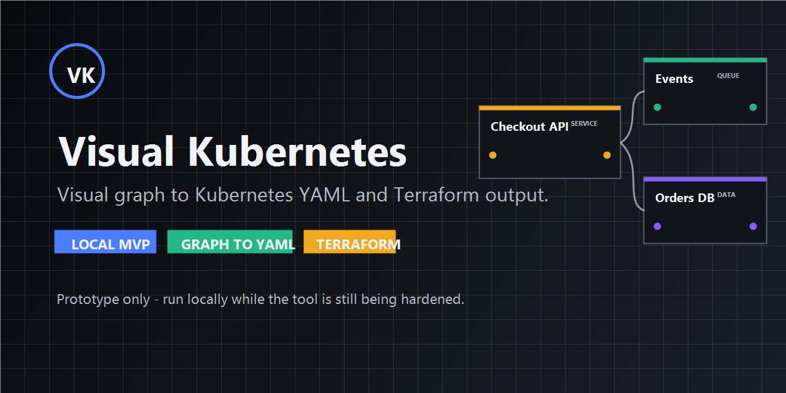

# Visual Kubernetes

Visual Kubernetes is an MVP for the idea described in the original concept note: a visual-first architecture workspace that lets engineers model a system, validate the design, and generate the infrastructure story without writing Kubernetes YAML by hand.



## Status and security notice

This project is an unfinished MVP/prototype. Run it locally only.

Do not deploy this app to a public server, put it behind the internet, or treat it as production software yet. The current focus is validating the product workflow and generated infrastructure model, not hardening the application for hostile users or public access.

Known prototype constraints:

- No authentication or authorization model has been designed.
- Local browser storage is used for workspace state.
- Exported YAML/Terraform should be reviewed before being applied to real infrastructure.
- Security hardening, threat modeling, input trust boundaries, and deployment controls are not complete.

If you are reviewing this repo, please evaluate the workflow and direction as an early local tool. Security feedback is welcome, but this is not being presented as a finished or production-ready system.

## Why Visual Kubernetes?

Kubernetes gives teams a powerful way to run real infrastructure, but the authoring experience usually starts in YAML. That makes it easy to lose the bigger picture: what talks to what, what runs where, what should be isolated, and what infrastructure will actually be created.

Visual Kubernetes starts from the architecture instead. Users model workloads, data stores, ingress, queues, security boundaries, and relationships on a canvas. From that model, the tool generates Kubernetes YAML and Terraform-oriented project output.

The goal is not to replace platform engineers or hide Kubernetes. The goal is to make infrastructure easier to design, review, teach, and bootstrap before teams commit to production-ready code.

## Who is this for?

Visual Kubernetes is intended for:

- Application developers who need a clearer path from app architecture to Kubernetes manifests.
- Platform and DevOps engineers who want to prototype infrastructure patterns visually.
- Teams reviewing service topology, namespaces, network policies, autoscaling, probes, and resource limits before implementation.
- Engineers learning Kubernetes who want to see how architecture decisions map to YAML.
- Early-stage teams that need a fast starting point for infrastructure-as-code instead of a blank folder.

## What is implemented

- Interactive React + TypeScript frontend built with Vite
- Visual architecture canvas rendered from a typed system model
- Drag-and-drop node repositioning on the canvas
- Property panel for editing selected components
- Local workspace persistence with `localStorage`
- Domain engine that:
  - Detects architecture pattern (`monolith`, `microservices`, `event-driven`, `hybrid`)
  - Validates invalid relationships and risky topology choices
  - Generates a deployment summary and Kubernetes object inventory
  - Exports Kubernetes YAML from the visual model
- Automated tests for engine behavior and a UI smoke flow
- GitHub Actions CI for install, lint, test, and build

## Current MVP scope

The current app models a growing set of Kubernetes-oriented components, including ingress, gateways, frontend/service workloads, workers, databases, caches, queues, jobs, cronjobs, network policies, and RBAC roles.

It also supports three relationship types:

- `http`
- `async`
- `data`

This is intentionally a narrow first slice. It establishes the product shape and the engineering baseline before expanding into topology editing, persistence beyond the browser, simulation, and runtime observability.

## Local development

Requirements:

- Node.js 22+ recommended

Install dependencies:

```bash
npm install
```

Run the development server:

```bash
npm run dev
```

Run the quality gates:

```bash
npm run lint
npm run test
npm run build
```

## Testing strategy

The repo starts with two testing layers:

- `src/engine.test.ts`
  Verifies pattern detection, validation rules, deployment-plan generation, and Kubernetes YAML export.
- `src/App.test.tsx`
  Verifies the UI renders the generated infrastructure view, updates state, and persists workspace changes.

This is the minimum bar required to make future expansion safe.

## CI

GitHub Actions runs on pushes to `main` and on pull requests:

1. `npm ci`
2. `npm run lint`
3. `npm run test`
4. `npm run build`

See [`.github/workflows/ci.yml`](D:/visual_kub/.github/workflows/ci.yml).

## Suggested next steps

- Replace the fixed SVG layout with true drag-and-drop graph editing
- Persist architecture models locally or in a backend
- Add topology templates for common patterns
- Generate export artifacts for Kubernetes or Terraform
- Introduce runtime simulation and observability overlays
